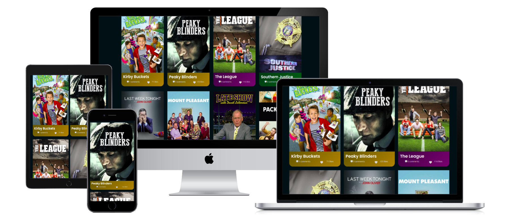

# Movies finder

## Built With

- Html
- Js
- webpack

 ## Getting Started

To get a local copy up and running follow these simple example steps.

- copy this link `https://github.com/camilevahviraki/Capstone-javascript.git`.
- get the directory that you want to clone the repository.
- open the command prompt in this directory.
- write `https://github.com/camilevahviraki/Capstone-javascript.git`.
- go to the repository folder in your command prompt `Capstone-javascript`.
- Open terminal in that folder and run `npm run start`.

## Live link

Type [type this link](https://camilevahviraki.github.io/Capstone-javascript/) to see the live demo

## Video link

Take a look on our [video of explaining](https://drive.google.com/file/d/1ivLEV4ah0aQQGOkLanM2d7MiiDBcuyp-/view) the project

## Authors

👤 **Author1**

- GitHub: [@camilevahviraki](https://github.com/camilevahviraki)
- Twitter: [@camilevahviraki](https://twitter.com/CamileVahviraki)
- LinkedIn: [camilevahviraki](https://www.linkedin.com/in/camile-vahviraki-8180a6232/)

## 🤝 Contributing

Contributions, issues, and feature requests are welcome!

Feel free to check the [issues page](../../issues/).

## Show your support

Give a ⭐️ if you like this project!

## Acknowledgments

- Inspiration: Microverse
- etc